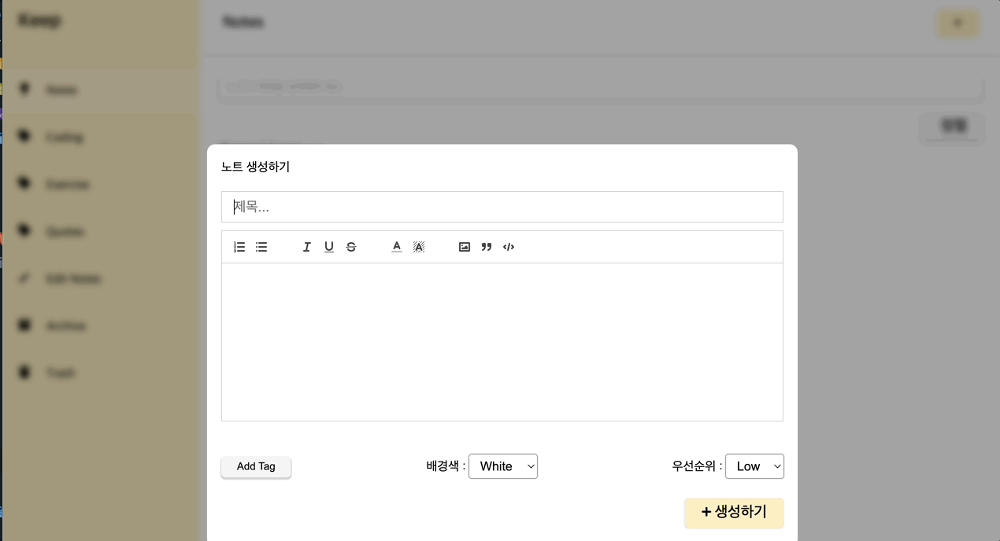

# 리액트 노트 앱 📝



위의 gif와 완전 동일하게 구현된 노트 관리 애플리케이션입니다.

## 🎯 구현 완료된 기능

- [] 상태 관리 라이브러리 리덕스 이용하기
- [] 타입스크립트 이용하기

### 📋 주요 기능
- **모달 스타일 노트 에디터**: GIF와 동일한 디자인
- **리치 텍스트 에디터**: 텍스트 포맷팅 도구 (굵게, 기울임, 밑줄, 취소선 등)
- **노트 관리**: 제목, 내용, 태그, 배경색, 우선순위 설정
- **사이드바**: 노트 목록 및 미리보기
- **실시간 상태 관리**: Redux를 통한 상태 관리

### 🛠 기술 스택
- **React** 19.1.1
- **TypeScript** 5.9.2
- **Redux Toolkit** 2.9.0
- **Vite** 7.1.5

## 🚀 실행 방법

```bash
# 의존성 설치
npm install

# 개발 서버 실행
npm run dev

# 빌드
npm run build
```

## 📁 프로젝트 구조

```
src/
├── components/
│   ├── FormatToolbar.tsx    # 텍스트 포맷팅 도구바
│   ├── NoteEditor.tsx       # 노트 에디터 (모달)
│   └── Sidebar.tsx          # 노트 목록 사이드바
├── store/
│   ├── index.ts            # Redux store 설정
│   └── notesSlice.ts       # 노트 관련 reducer
├── types/
│   └── index.ts            # TypeScript 타입 정의
├── App.tsx                 # 메인 앱 컴포넌트
├── App.css                 # 스타일시트
└── main.tsx               # 앱 진입점
```

## 🎨 스타일링
- GIF 이미지와 완전히 동일한 디자인
- 모달 기반의 노트 에디터
- 반응형 레이아웃
- 깔끔한 UI/UX

## ✨ 포맷팅 기능
- 불릿/번호 목록
- 굵게, 기울임, 밑줄, 취소선
- 글자 색상 변경
- 글자 크기 조절
- 인용문, 코드 블록